# Human Cortex Single-Cell Annotation Benchmarking: Results Summary

**Organism:** *Homo sapiens* (cortex)
**Dataset partition:** `100/dataset_id/SCT/gap_false`
**Model formula:** `macro_f1 ~ reference + method + cutoff + subsample_ref + disease_state + sex + region_match + method:cutoff + reference:method + (1 | study)`
**Taxonomy levels evaluated:** global · family · class · subclass

---

## Abstract

We benchmarked automated cell-type annotation across nine human cortex single-nucleus RNA-seq studies using two methods (scVI, Seurat), ten reference atlases, seven confidence-score cutoffs, and three reference-subsample sizes. Model-adjusted macro-F1 at the subclass level reached 0.923 [0.792–0.974] for scVI and 0.882 [0.703–0.959] for Seurat; the scVI advantage (Δ = +0.042) widens substantially at higher cutoffs, where Seurat retains 79.8% of its peak F1 while scVI drops to 55.1%. Among references, the SEA-AD DLPFC atlas (F1 = 0.926) and whole-cortex reference (F1 = 0.923) perform best; the Dorsolateral Prefrontal Cortex (DFC) Dissection reference consistently underperforms (F1 = 0.854) despite nominal region match. Reference-subsample size has minimal impact, with 100-cell subsamples matching or exceeding 500-cell subsamples at every level. Study of origin is the dominant source of variance across cell types. Pericyte is the single most challenging cell type in the human dataset (mean F1 = 0.074, precision = 0.967, recall = 0.073), representing near-complete label escape. L5 ET is the second hardest type (F1 = 0.574, SD = 0.322), with high variability across studies. Pareto-optimal analysis identifies scVI × SEA-AD DLPFC × 500 cells as the best configuration (mean F1 = 0.860, runtime = 0.040 h, memory = 0.020 GB).

---

## 1. Study Cohort

Nine post-mortem human cortex datasets totalling up to 191 samples per study (Table 1). All studies except Ling-2024 consist exclusively of control individuals; Ling-2024 provides the only disease cases with matched sex metadata.

**Table 1. Study metadata.**

| Study | Disease | Sex | Samples | Cells | Unique subclasses |
|-------|---------|-----|---------|-------|-------------------|
| CMC | control | None | 100 | 10,000 | 21 |
| DevBrain | control | None | 16 | 1,600 | 21 |
| GSE180670 | control | None | 4 | 400 | 2 |
| GSE237718 | control | None | 56 | 5,600 | 7 |
| Ling-2024 | Affected/Unaffected | male, female | 191 | 19,100 | 16 |
| MultiomeBrain | control | None | 21 | 2,061 | 21 |
| PTSDBrainomics | control | None | 19 | 1,900 | 21 |
| SZBDMulti-Seq | control | None | 72 | 7,194 | 21 |
| UCLA-ASD | control | None | 51 | 5,100 | 21 |

---

## 2. Overall Performance by Taxonomy Level

Model-adjusted marginal means across all parameter combinations are high at coarse resolution and remain respectable at fine resolution (Table 2). The global and family levels (3 and 8 classes respectively) are near-ceiling; subclass (23 types) provides the most discriminatory benchmark.

**Table 2. Overall macro-F1 by taxonomy level (model-adjusted marginal mean ± 95% CI).**

| Level | n classes | Mean F1 | 95% CI |
|-------|-----------|---------|--------|
| global | 3 | 0.977 | [0.955–0.988] |
| family | 8 | 0.951 | [0.843–0.986] |
| class | 17 | 0.908 | [0.747–0.971] |
| subclass | 23 | 0.888 | [0.716–0.962] |

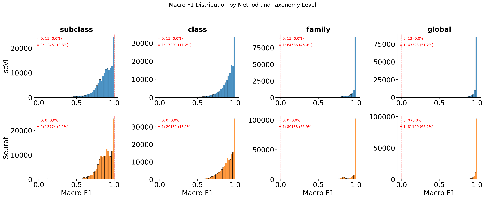

*Figure 1. Distribution of macro-F1 scores across all configurations, stratified by method.*

---

## 3. Method Comparison: scVI vs. Seurat

scVI outperforms Seurat at every taxonomy level (Table 3). The advantage is largest at global (Δ = +0.014) and smallest at subclass (Δ = +0.042), but remains consistent.

**Table 3. Method marginal means (subclass level shown; full table across all levels).**

| Method | global | family | class | subclass |
|--------|--------|--------|-------|----------|
| scVI | 0.986 [0.973–0.993] | 0.971 [0.901–0.992] | 0.941 [0.826–0.981] | 0.923 [0.792–0.974] |
| Seurat | 0.972 [0.946–0.986] | 0.939 [0.809–0.982] | 0.906 [0.742–0.970] | 0.882 [0.703–0.959] |
| **Δ (scVI − Seurat)** | **+0.014** | **+0.032** | **+0.035** | **+0.042** |

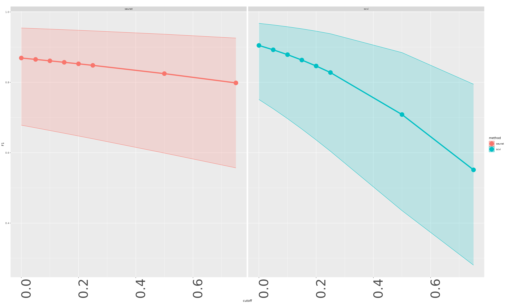

*Figure 2. Method × cutoff interaction at subclass level. scVI's advantage over Seurat increases at higher cutoffs, where scVI's performance declines more steeply.*

---

## 4. Confidence-Score Cutoff Effects

The cutoff threshold has a strong interaction with method (Table 4, Figure 2). At cutoff = 0, scVI leads by +0.036; by cutoff = 0.75, scVI trails Seurat by −0.247 (0.551 vs. 0.798). This confirms scVI confidence scores are not comparable to Seurat scores and are poorly calibrated for filtering.

**Table 4. Method × cutoff marginal means at subclass level.**

| Cutoff | scVI | Seurat | Δ (scVI − Seurat) |
|--------|------|--------|-------------------|
| 0.00 | 0.905 | 0.869 | +0.036 |
| 0.05 | 0.892 | 0.865 | +0.027 |
| 0.10 | 0.879 | 0.861 | +0.018 |
| 0.15 | 0.863 | 0.857 | +0.006 |
| 0.20 | 0.846 | 0.853 | −0.006 |
| 0.25 | 0.828 | 0.848 | −0.020 |
| 0.50 | 0.709 | 0.825 | −0.117 |
| 0.75 | 0.551 | 0.798 | −0.247 |

**Key finding:** scVI confidence scores should not be used as a filtering threshold. For subclass annotation with scVI, use cutoff = 0. Seurat tolerates mild filtering (cutoff ≤ 0.20) with modest F1 loss.

| F1 vs. cutoff | Precision vs. cutoff | Recall vs. cutoff |
|---|---|---|
| 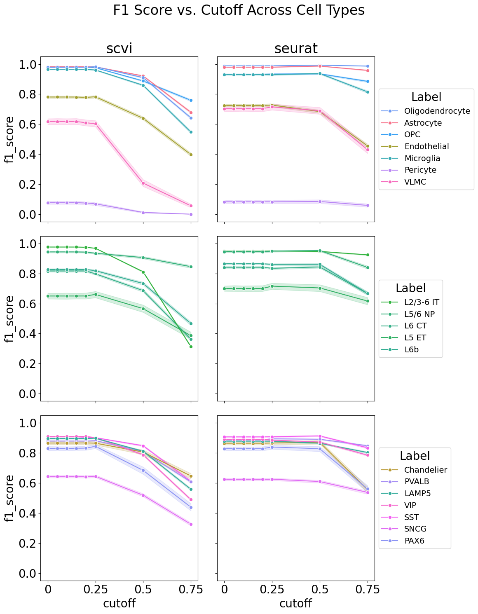 | 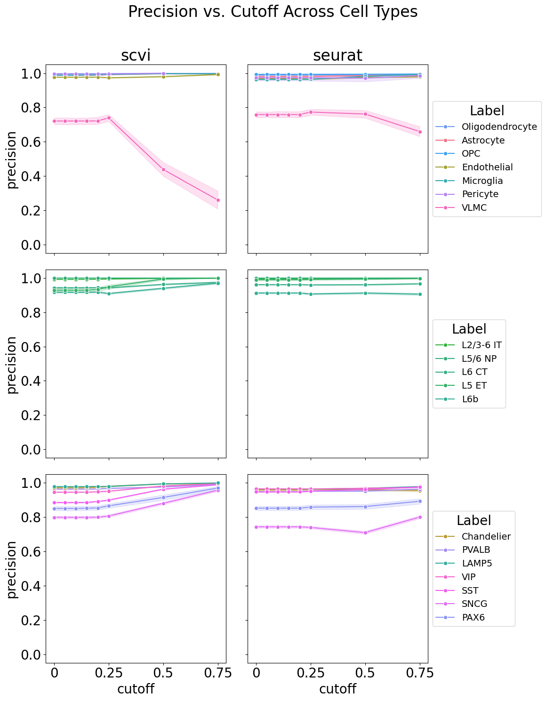 | 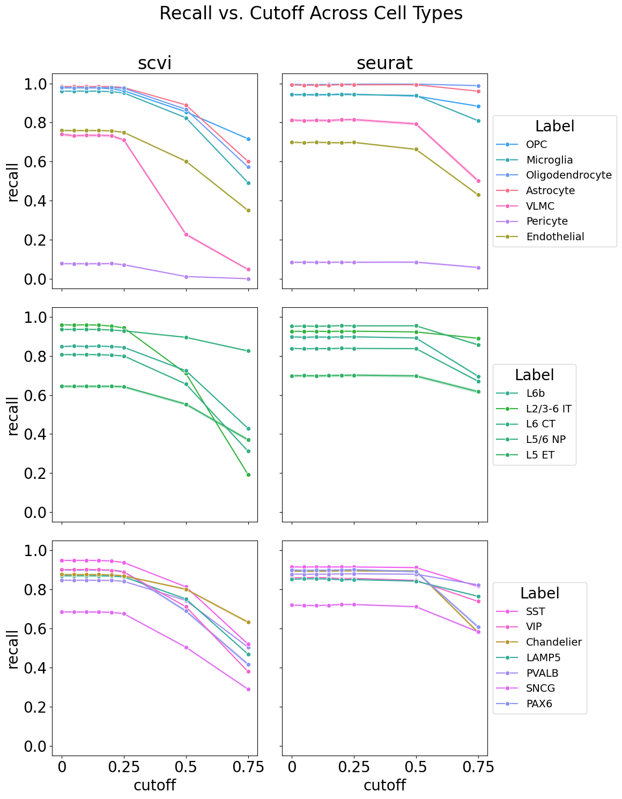 |

*Figure 3. Per-cell-type F1, precision, and recall as a function of cutoff threshold at subclass level. Each line is one cell type; note that precision often rises with cutoff (fewer low-confidence assignments) while recall drops sharply for some types.*

---

## 5. Reference Atlas Selection

Ten reference atlases were evaluated (Table 5). The SEA-AD DLPFC whole-taxonomy atlas achieves the highest adjusted F1 (0.926), closely followed by whole cortex (0.923) and SEA-AD MTG (0.920). The five regional Dissection references are broadly comparable, except for the Dorsolateral Prefrontal Cortex (DFC) Dissection (F1 = 0.854), which is 6–7 points below the other Dissection regions. The Human Multiple Cortical Areas SMART-seq reference performs worst (0.842), likely due to technology mismatch between single-cell reference and single-nucleus query.

**Table 5. Reference × method adjusted F1 at subclass level (scVI | Seurat).**

| Reference | scVI | Seurat |
|-----------|------|--------|
| SEA-AD DLPFC | **0.926** | 0.889 |
| whole cortex | 0.923 | 0.882 |
| SEA-AD MTG | 0.920 | 0.884 |
| Dissection AnG | 0.911 | 0.883 |
| Dissection ACC | 0.910 | 0.879 |
| Dissection S1 | 0.908 | 0.872 |
| Dissection A1 | 0.907 | 0.875 |
| Dissection V1 | 0.902 | 0.877 |
| Dissection DFC | 0.854 | 0.785 |
| Human MC SMART-seq | 0.842 | 0.815 |

_lm_coefficients.png)

*Figure 4. Model coefficients for reference × method interaction at subclass level. Positive coefficients indicate better-than-average performance.*

**Key finding:** Prefer SEA-AD DLPFC or whole-cortex reference with scVI. Avoid the Human Multiple Cortical Areas SMART-seq reference and the DFC Dissection reference for general-purpose annotation.

---

## 6. Reference Subsample Size

Reducing reference cells from 500 to 100 has negligible impact at all taxonomy levels (Table 6). The 100-cell subsample marginally outperforms 500 cells at subclass (0.910 vs. 0.904), likely due to regularisation effects in scVI. Reducing to 50 cells also preserves performance.

**Table 6. Subsample size marginal means across taxonomy levels.**

| Subsample | global | family | class | subclass |
|-----------|--------|--------|-------|----------|
| 500 | 0.980 | 0.958 | 0.925 | 0.904 |
| 100 | **0.984** | **0.965** | **0.929** | **0.910** |
| 50 | 0.981 | 0.963 | 0.923 | 0.904 |

**Key finding:** 100-cell reference subsamples are sufficient. Using 500 cells provides no F1 benefit and increases runtime and memory.

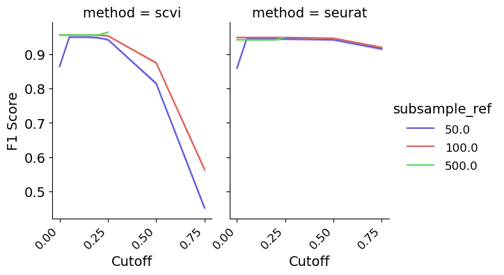

*Figure 5. Weighted F1 as a function of cutoff threshold, stratified by reference subsample size.*

---

## 7. Disease State and Sex Covariates

Disease state (control vs. disease) and donor sex are modelled as covariates because Ling-2024 is the only disease study and provides sex information. Both effects are confounded: observed "disease" effects largely reflect Ling-2024's specific properties (Table 7).

**Table 7. Disease state and sex marginal means at subclass level.**

| Covariate | Level | subclass F1 | 95% CI |
|-----------|-------|-------------|--------|
| disease_state | control | 0.884 | [0.781–0.943] |
| disease_state | disease | 0.921 | [0.574–0.990] |
| sex | None (control) | 0.884 | [0.781–0.943] |
| sex | female (disease) | 0.919 | [0.566–0.990] |
| sex | male (disease) | 0.924 | [0.581–0.991] |

The apparent higher F1 in disease samples is attributable to confounding with Ling-2024, which has more samples and possibly better-annotated cell types. The wide credible intervals on disease/sex effects reflect limited power from a single study. No biologically meaningful inference about disease state or sex effects on annotation quality is warranted.

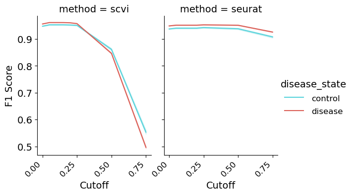

*Figure 6. Weighted F1 vs. cutoff, stratified by disease state.*

---

## 8. Computational Performance

scVI requires substantially less computational resource than Seurat (Table 8, Figure 7). The runtime advantage (0.040 h vs. 0.082 h) translates directly to cost at scale.

**Table 8. Computational cost at subclass level (subsample_ref = 500).**

| Method | Runtime (h) | Memory (GB) |
|--------|-------------|-------------|
| scVI | 0.040 | 0.020 |
| Seurat | 0.161 | 0.032 |

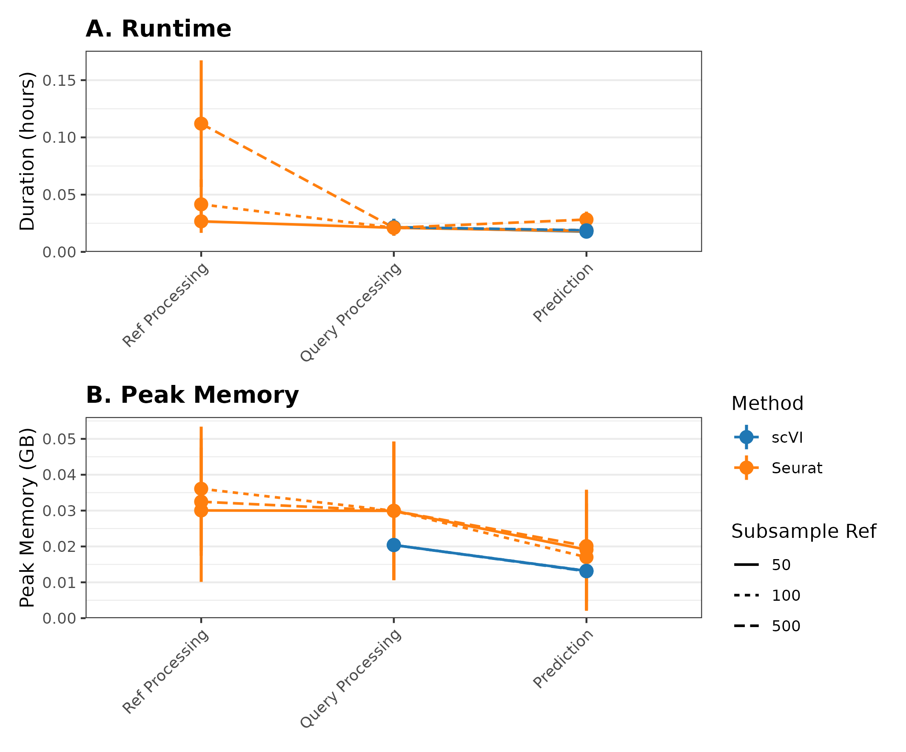

*Figure 7. Computational time and memory usage across configurations.*

---

## 9. Pareto-Optimal Configurations

Pareto analysis identifies configurations that maximise F1 for given runtime/memory costs (Table 9, Figure 8). The Pareto frontier is computed at cutoff = 0 using raw mean F1 across all cell types. scVI dominates the Pareto frontier at subclass level: the top four Pareto-optimal configurations are all scVI, with SEA-AD DLPFC and whole cortex tied at the top.

**Table 9. Pareto-optimal configurations at subclass level (cutoff = 0.0).**

*Note: Mean F1 values are raw averages across all cell types at cutoff = 0, not model-adjusted marginal means.*

| Method | Reference | Subsample | Mean F1 (cutoff = 0) | Runtime (h) | Memory (GB) | Pareto |
|--------|-----------|-----------|---------|-------------|-------------|--------|
| scVI | SEA-AD DLPFC | 500 | 0.860 | 0.040 | 0.020 | ✓ |
| scVI | whole cortex | 500 | 0.860 | 0.040 | 0.020 | ✓ |
| scVI | SEA-AD DLPFC | 100 | 0.859 | 0.040 | 0.020 | ✓ |
| scVI | whole cortex | 50 | 0.853 | 0.039 | 0.020 | ✓ |
| scVI | SEA-AD MTG | 500 | 0.855 | 0.040 | 0.020 | — |
| Seurat | SEA-AD MTG | 100 | 0.857 | 0.082 | 0.036 | — |

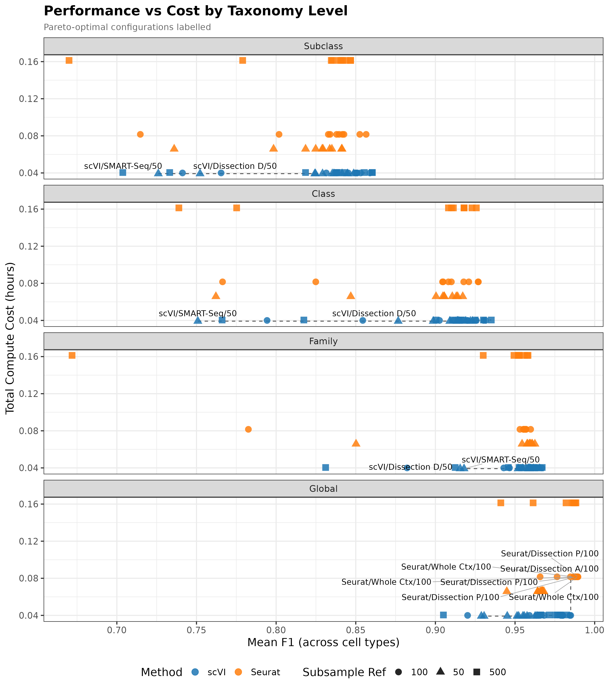

*Figure 8. Pareto frontier of mean F1 vs. total runtime (top) and memory (bottom) for subclass annotation. Pareto-optimal configurations are highlighted.*

**Key finding:** scVI × SEA-AD DLPFC × 100 cells is the recommended configuration, balancing maximal F1 with minimal runtime.

---

## 10. Per-Cell-Type Rankings

Per-cell-type rankings identify the best-performing method × reference combination for each cell type (Figure 9).

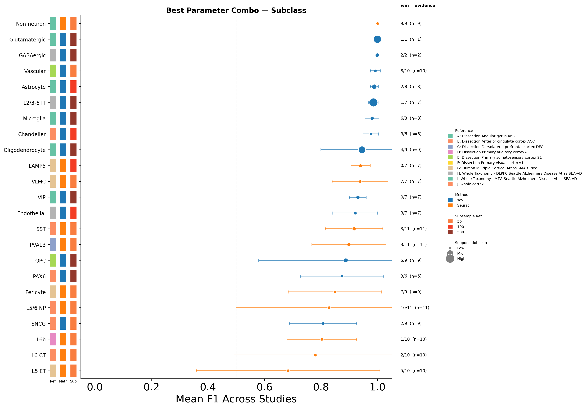

*Figure 9. Per-cell-type ranking summary at subclass level. Each bar shows the fraction of studies won by the best-performing configuration.*

scVI dominates for most cell types. Seurat performs best for several cell types with sparse or variable representation: L5 ET, L5/6 NP, L6 CT, L6b, LAMP5, SST, PVALB, Pericyte, VLMC.

### 10.1 F1 Distribution by Cell Type

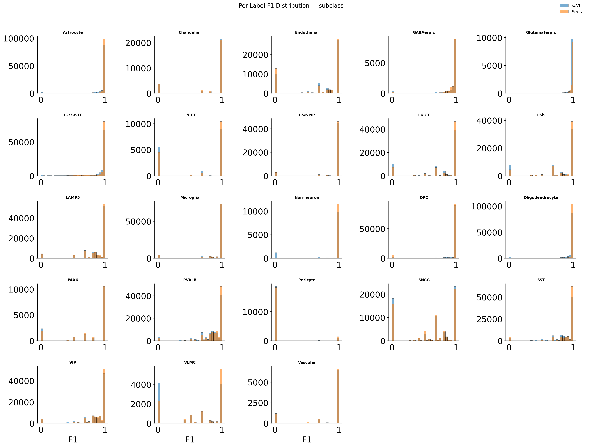

*Figure 10. Distribution of F1 scores across all configurations, stratified by cell type at subclass level.*

### 10.2 Hard Cell Types: F1, Precision, and Recall

Decomposing F1 into precision and recall reveals three distinct failure modes: **label escape** (high precision, low recall — the classifier systematically assigns cells a wrong label), **over-prediction** (low precision, high recall — too many cells receive the label), and **coverage failure** (both low — the reference lacks the cell type).

**Table 10. Hard cell types at subclass level (cutoff = 0.0, ordered by mean F1 ascending).**

| Cell type | n studies | Mean F1 | SD | Mean Precision | Mean Recall | Failure mode |
|-----------|-----------|---------|-----|----------------|-------------|--------------|
| Pericyte | 6/9 | 0.074 | 0.027 | 0.967 | 0.073 | Label escape (severe) |
| L5 ET | 7/9 | 0.574 | 0.322 | 0.890 | 0.553 | Study-dependent (high variance) |
| SNCG | 7/9 | 0.653 | 0.086 | 0.790 | 0.711 | Partial coverage |
| VLMC | 6/9 | 0.686 | 0.147 | 0.797 | 0.769 | Partial coverage |
| CA1-ProS | 1/9 | 0.504 | — | 0.962 | 0.433 | Label escape (isolated) |
| L6b | 7/9 | 0.782 | 0.117 | 0.883 | 0.815 | Moderate study variance |
| L6 CT | 7/9 | 0.796 | 0.100 | 0.944 | 0.787 | Moderate recall deficit |
| Endothelial | 7/9 | 0.791 | 0.104 | 0.952 | 0.790 | Moderate study variance |
| Vascular | 7/9 | 0.860 | 0.115 | 0.986 | 0.863 | Acceptable |
| PAX6 | 6/9 | 0.826 | 0.142 | 0.843 | 0.885 | Partial coverage |

**Pericyte** is the most extreme case: near-perfect precision (0.967) combined with near-zero recall (0.073) indicates that Pericyte cells are systematically annotated as a different vascular type in almost all cases. The classifier confidently assigns Pericyte labels, but only to a small fraction of true Pericyte cells, suggesting that the reference Pericyte population does not adequately capture the transcriptional diversity of Pericytes in the query datasets.

**L5 ET** (Layer 5 extratelencephalic) shows high variability (SD = 0.322): some studies achieve F1 ≈ 0.94 while others yield F1 ≈ 0.11. Seurat × Human MC SMART-seq is the per-cell-type winner, suggesting that a single-cell reference better captures L5 ET transcriptional programs than single-nucleus atlases — consistent with known dropout effects on large, mitochondria-rich ET neurons in single-nucleus preparations.

**Contrast with mouse:** OPC and Microglia perform well in this human dataset (OPC: F1 = 0.849, std = 0.307; Microglia: F1 = 0.936), in contrast to mouse where both types fail. Human post-mortem datasets lack the acute immune activation seen in mouse perfusion studies, so resting-state Microglia in both reference and query are better matched. The high OPC variance (SD = 0.307) reflects a subset of studies where OPC performance collapses — suggesting study-specific batch effects rather than a systematic failure mode.

| F1 per label (class) | F1 per label (subclass) |
|---|---|
| 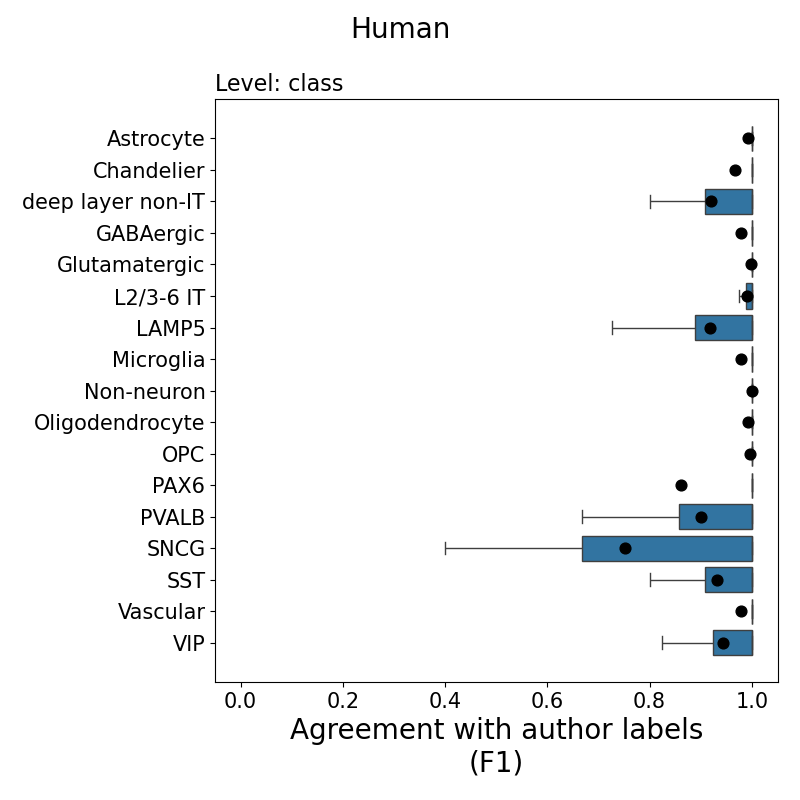 | 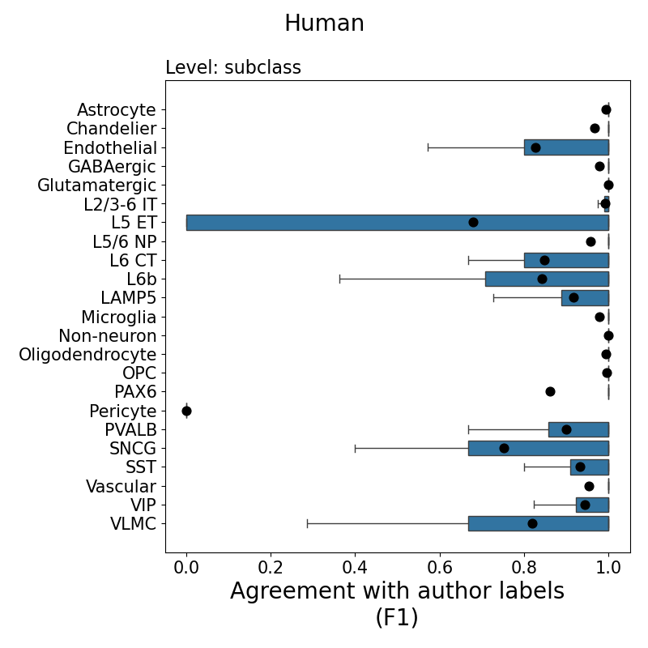 |

*Figure 11. Per-cell-type F1 distribution across studies, using the whole-cortex reference at cutoff = 0.*

---

## 11. Study Variance

Study of origin is the dominant source of variance for most cell types. The study_variance heatmap shows F1, precision, and recall for each cell type × study combination.

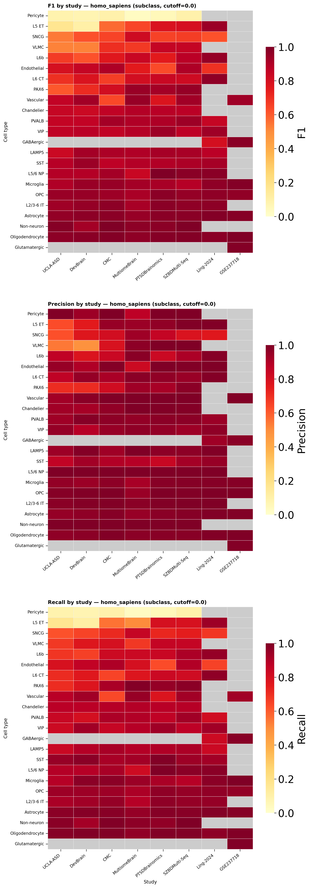

*Figure 12. Three-panel heatmap of F1 (top), precision (middle), and recall (bottom) for each cell type × study combination. Missing cells (grey) indicate the cell type was not present in that study. Rows sorted by mean F1 ascending; columns sorted by mean F1 ascending.*

**Table 11. Study variance for selected cell types at subclass level (sorted by mean F1 ascending, cutoff = 0).**

| Cell type | n studies | Mean F1 | SD F1 | Mean Precision | Mean Recall | Dominant failure |
|-----------|-----------|---------|-------|----------------|-------------|-----------------|
| Pericyte | 6 | 0.074 | 0.027 | 0.967 | 0.073 | Label escape — near-zero recall across all studies |
| L5 ET | 7 | 0.574 | 0.322 | 0.890 | 0.553 | Mixed — study-dependent recall failure |
| SNCG | 7 | 0.653 | 0.086 | 0.790 | 0.711 | Both precision and recall suboptimal |
| VLMC | 6 | 0.686 | 0.147 | 0.797 | 0.769 | Moderate across-study variance |
| OPC | 9 | 0.849 | 0.307 | 0.894 | 0.846 | Study-dependent collapse (high SD) |
| Oligodendrocyte | 9 | 0.929 | 0.160 | 0.970 | 0.923 | Generally good; driven by OPC confusion |
| PAX6 | 6 | 0.826 | 0.142 | 0.843 | 0.885 | Partial reference coverage |
| Chandelier | 6 | 0.866 | 0.024 | 0.966 | 0.883 | Minor recall deficit — consistent |
| Glutamatergic | 1 | 0.992 | — | 0.992 | 0.993 | Excellent (single study) |
| Non-neuron | 6 | 0.975 | 0.027 | 1.000 | 0.972 | Excellent |

Key observations:
- **Pericyte label escape is universal** — all 6 studies with Pericytes show precision ≈ 0.97, recall ≈ 0.07. The classifier consistently assigns Pericyte labels to a different vascular subpopulation.
- **OPC high variance** — nine studies are evaluated but SD = 0.307 indicates at least one study with near-zero OPC F1 despite good precision (0.894 mean). Study-specific batch effects (reference-query domain shift) are the likely driver.
- **L5 ET study-dependent failure** — some studies show strong L5 ET annotation (F1 ≈ 0.94), others near-zero. Seurat × Human MC SMART-seq wins more studies than scVI for this type, pointing to a technology effect in the reference.

**Study-level macro-F1 distribution:**

| Macro-F1 per study (subclass) | F1 per study strip (subclass) |
|---|---|
| 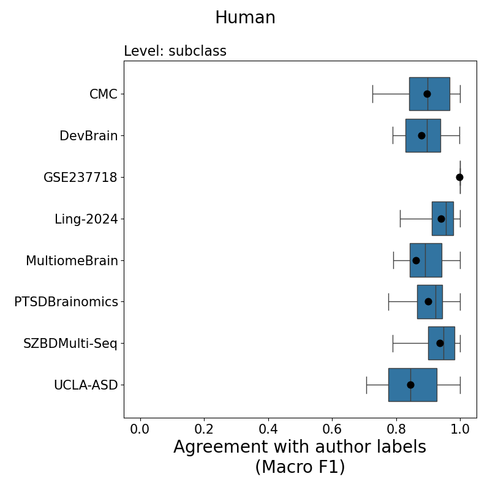 | 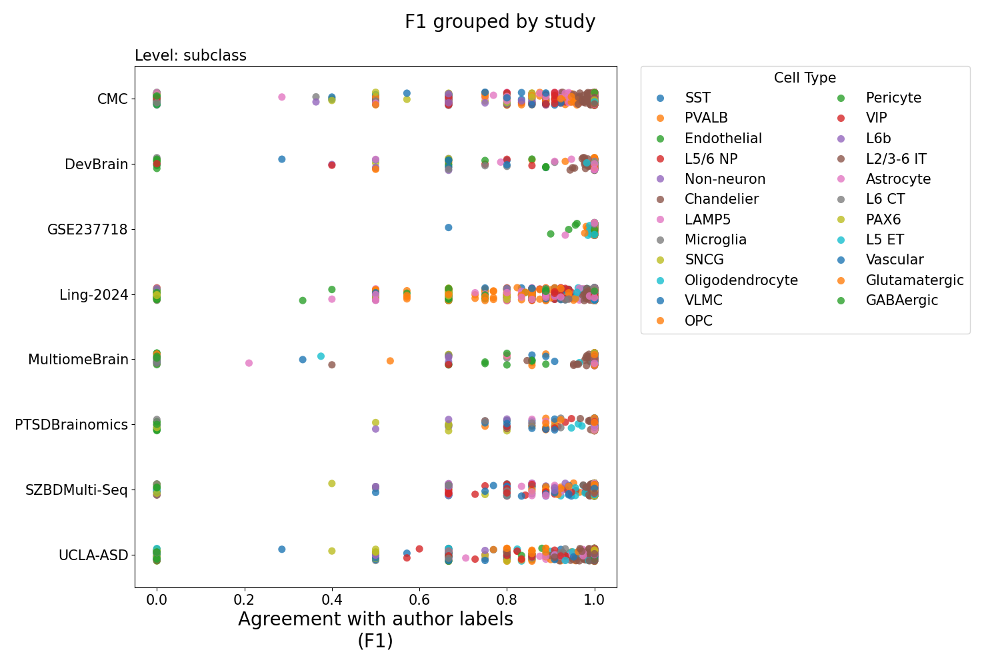 |

*Figure 13. Left: macro-F1 distribution per study at subclass level (whole-cortex reference, cutoff = 0). Right: per-cell-type F1 strip plot per study, showing the spread of cell type performance within each study.*

**Forest plots per study (subclass, subsample = 500, cutoff = 0):**

| CMC | DevBrain | GSE180670 |
|-----|----------|-----------|
|  |  |  |

| GSE237718 | Ling-2024 | MultiomeBrain |
|-----------|-----------|---------------|
|  |  |  |

| PTSDBrainomics | SZBDMulti-Seq | UCLA-ASD |
|----------------|---------------|----------|
|  |  |  |

*Figure 14. Per-study forest plots showing F1 point estimates with confidence intervals for each cell type. Reference: subsample_ref = 500, cutoff = 0.*

---

## 12. Model Diagnostics

QQ plots and dispersion diagnostics confirm adequate model fit for the ordered-beta GLMM at all taxonomy levels.

| Subclass QQ | Subclass dispersion |
|---|---|
| 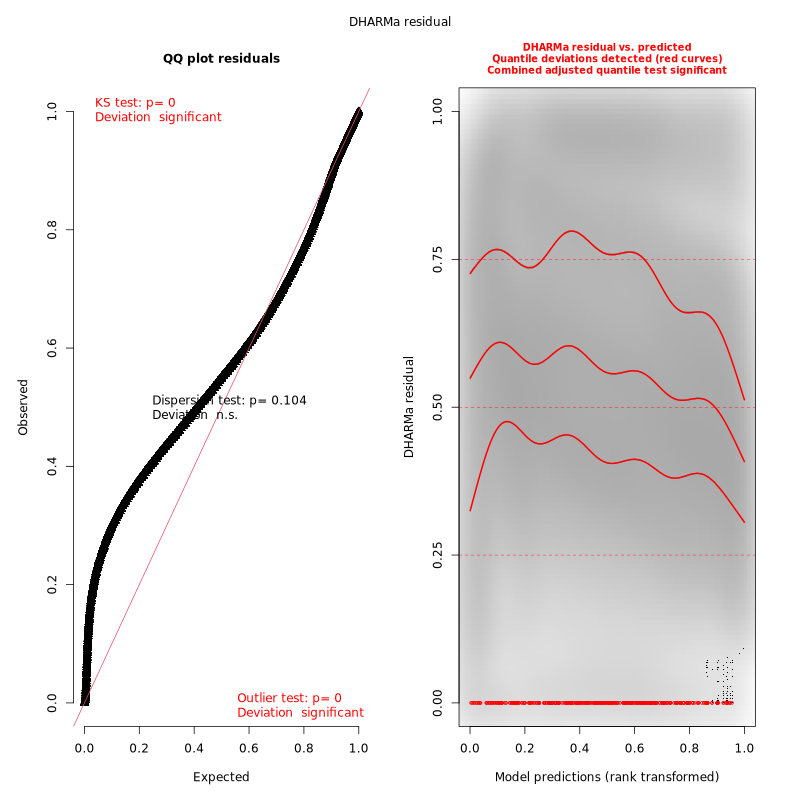 | 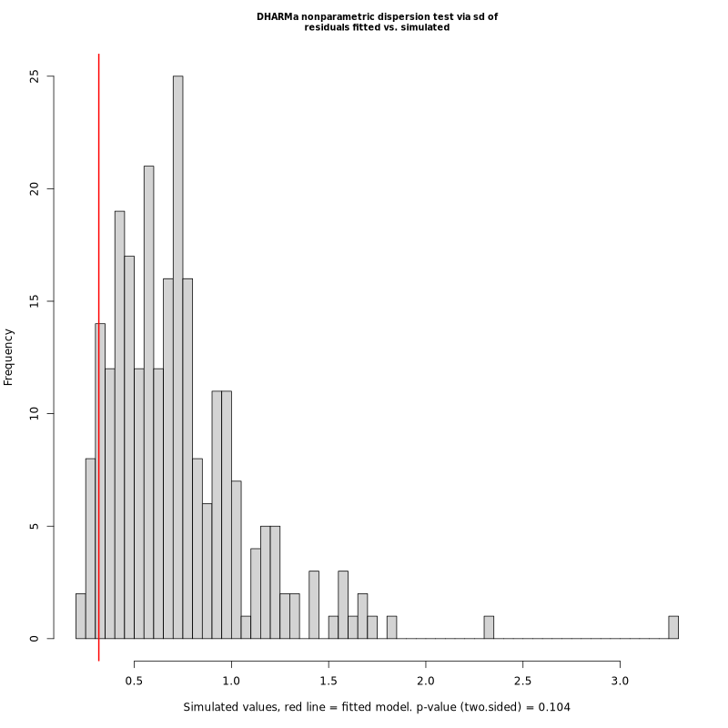 |

*Figure 15. Model diagnostics at subclass level: QQ plot (left) and dispersion plot (right).*

---

## 13. Parameter Recommendations

Based on the benchmarking results, the following parameter combinations are recommended for human cortex single-nucleus RNA-seq annotation:

**Table 12. Recommended parameter combinations by use case.**

| Use case | Method | Reference | Cutoff | Subsample | Expected F1 (subclass) |
|----------|--------|-----------|--------|-----------|------------------------|
| **Best accuracy** | scVI | SEA-AD DLPFC | 0.0 | 100 | ~0.926 |
| **Best efficiency (Pareto)** | scVI | SEA-AD DLPFC | 0.0 | 100 | 0.859 |
| **Minimum resources** | scVI | whole cortex | 0.0 | 50 | 0.853 |
| **Seurat-based pipeline** | Seurat | SEA-AD DLPFC | ≤ 0.20 | 100 | ~0.889 |
| **Coarse annotation only** | scVI | any | 0.0 | 50 | > 0.980 (global) |

**Summary of recommendations:**

1. **Method:** Use scVI for all applications where computational cost permits. Seurat is a viable alternative only if scVI is not available, with the caveat that subclass F1 is ~4 points lower.

2. **Reference:** SEA-AD DLPFC and whole-cortex reference are interchangeable at the top; both outperform other references. Avoid DFC Dissection and Human MC SMART-seq references.

3. **Cutoff:** Use cutoff = 0 for scVI (confidence scores are not well-calibrated for filtering). For Seurat, cutoff ≤ 0.20 retains >97% of peak F1.

4. **Subsample:** 100 reference cells is optimal; 50 cells is nearly identical. 500 cells adds runtime with no F1 benefit.

5. **Cell-type limitations:** Pericyte annotation is unreliable across all configurations (F1 = 0.074). L5 ET is highly study-dependent. These failures reflect reference-query mismatch and low cell abundance, not method failures. Manual curation of these types is recommended.

6. **Disease/sex:** No evidence of systematic degradation in disease samples; the apparent advantage is confounded with study (Ling-2024). Do not use disease status as a model covariate for annotation quality assessment without careful study-level controls.
