# Cell-type Annotation Benchmarking in Mouse Brain: Parameter Sensitivity and Performance Analysis

*Automated summary generated from pipeline outputs in `100/dataset_id/SCT/gap_false/`. All model estimates are from ordered beta-regression GLMMs (glmmTMB, ordbeta family) with study as a random intercept. Marginal means are estimated via the emmeans package on the response (probability) scale. Figures and tables are linked by relative path from this file.*

---

## Abstract

We benchmarked two automated cell-type annotation methods—scVI and Seurat—across seven mouse brain single-cell RNA-sequencing studies spanning diverse brain regions and experimental conditions. Using an ordered beta-regression generalized linear mixed model (GLMM) framework with study as a random intercept, we evaluated the effects of annotation method, reference atlas, confidence cutoff threshold, and reference subsampling size on macro F1 performance at four hierarchical taxonomy levels (global, family, class, subclass). At the subclass level—the most granular level—scVI achieved a model-adjusted marginal mean F1 of 0.822 [0.731–0.887] versus 0.773 [0.668–0.853] for Seurat (Δ = 0.049). However, scVI is substantially more sensitive to confidence cutoff filtering: raising the cutoff from 0.0 to 0.75 reduces subclass F1 by 0.506 points for scVI but only 0.060 for Seurat. Reference atlas selection had a meaningful effect, with the motor cortex reference uniquely enabling Seurat to slightly exceed scVI at subclass (0.833 vs. 0.819). Reference subsampling at 100 versus 500 cells produced negligible performance differences. Several cell types—particularly OPC (mean F1 = 0.016), Microglia (0.116), and Neural stem cell (0.155)—showed near-zero or highly variable performance attributable to transcriptional overlap, activation-state confounding, or rarity. For a general-purpose annotation pipeline, we recommend **scVI at cutoff = 0.0 with the whole cortex reference and 100 reference cells**, which achieves Pareto-optimal performance relative to computational cost.

---

## 1. Dataset and Study Characteristics

Annotation accuracy was evaluated across **7 GEO studies** (Table 1) comprising single-cell and single-nucleus RNA-seq data from diverse mouse brain regions. All studies used wild-type C57BL/6 mice (GSE214244.1 additionally included AppNL-G-F/NL-G-F Alzheimer's disease model animals), with samples subsampled to 100 cells per sample, SCT normalization, and gap filtering disabled. Experimental perturbations included cocaine and saline treatment (GSE124952), Setd1a CRISPR-Cas9 editing (GSE181021.2), HDAC inhibitor administration during contextual fear conditioning (GSE185454), TBI with and without T4 thyroid hormone treatment (GSE247339.1/2), and an untreated whole-brain dataset (GSE199460.2). Brain regions sampled included nucleus accumbens (core), prefrontal cortex, hippocampus (dentate gyrus), entorhinal cortex, Ammon's horn, and cerebral cortex. This diversity of regions, cell types, and perturbations constitutes a stringent test of annotation generalizability.

**Table 1: Study metadata.**

| Study | Treatment | Brain Region | Samples | Cells | Subclasses |
|---|---|---|---|---|---|
| GSE124952 | cocaine, saline | nucleus accumbens | 15 | 1,500 | 7 |
| GSE181021.2 | Setd1a CRISPR-Cas9 | prefrontal cortex | 4 | 400 | 7 |
| GSE185454 | HDACi, vehicle (CFC) | hippocampus (DG) | 4 | 400 | 9 |
| GSE199460.2 | none | brain | 2 | 198 | 1 |
| GSE214244.1 | none (Alzheimer's model) | entorhinal cortex | 3 | 300 | 8 |
| GSE247339.1 | TBI, sham, T4 | Ammon's horn | 21 | 2,089 | 10 |
| GSE247339.2 | TBI, sham, T4 | cerebral cortex | 20 | 1,993 | 10 |

Four reference atlases were evaluated: (1) **whole cortex** — Allen Brain Atlas whole mouse cortex; (2) **motor cortex** — integrated transcriptomic and epigenomic atlas of mouse primary motor cortex (Yao et al.); (3) **hippocampal 10x** — single-cell RNA-seq of all cortical and hippocampal regions, 10x Genomics protocol; and (4) **hippocampal SMART-Seq** — SMART-Seq v4 version of the hippocampal atlas. Confidence cutoffs from 0.0 to 0.75 were evaluated in eight steps, and reference subsampling sizes of 50, 100, and 500 cells were compared.

---

## 2. Statistical Model

Macro F1 scores were modeled using an ordered beta regression GLMM:

```
macro_f1 ~ reference + method + cutoff + subsample_ref +
           treatment_state + sex + method:cutoff + reference:method +
           (1 | study)
```

The ordered beta family (Kubinec 2023) handles boundary-inflated bounded continuous outcomes (F1 ∈ [0, 1]) without the constraints of standard beta regression. Study is included as a random intercept to account for dataset-specific baseline difficulty. All fixed-effect estimates are expressed as marginal means on the response scale via the `emmeans` package. Model diagnostics (QQ plots, dispersion plots) are available in `100/dataset_id/SCT/gap_false/aggregated_models/.../figures/`.

---

## 3. Overall Annotation Performance

**Figure 1: Publication-quality summary of annotation performance across methods, references, and taxonomy levels.**

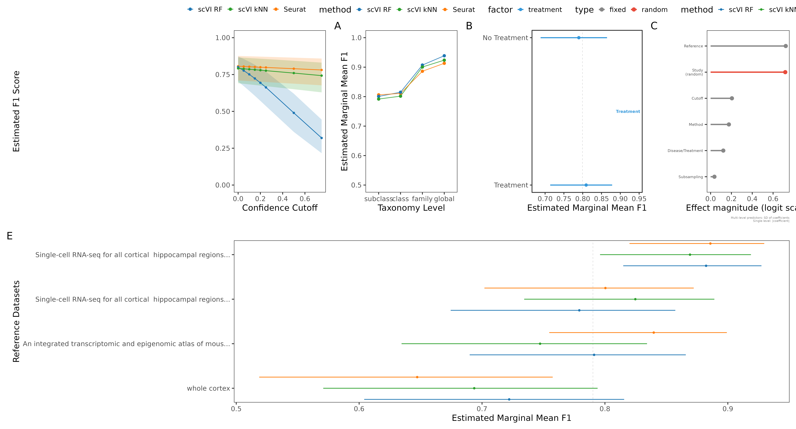

The GLMM-estimated overall marginal means collapsed across all parameter combinations (Table 2) show a clear hierarchy across taxonomy levels, with coarser labels being substantially easier to annotate than fine-grained subclass labels.

**Table 2: Model-adjusted overall marginal means across all parameters (95% CI).**

| Taxonomy level | Marginal mean F1 | 95% CI |
|---|---|---|
| global | 0.942 | [0.891–0.970] |
| family | 0.870 | [0.819–0.908] |
| class | 0.799 | [0.687–0.878] |
| subclass | 0.783 | [0.680–0.859] |

The drop from global to subclass reflects the increasing number of biologically similar cell populations that must be distinguished at finer resolution. Notably, even at the subclass level the model-marginal mean of 0.783 masks substantial heterogeneity: a few very poorly annotated cell types (OPC, Microglia; see Section 9) drag down the average while the majority of subclasses achieve F1 > 0.85.

**Figure 2: Per-label F1 score distributions at subclass level (whole cortex reference, cutoff = 0.0).**

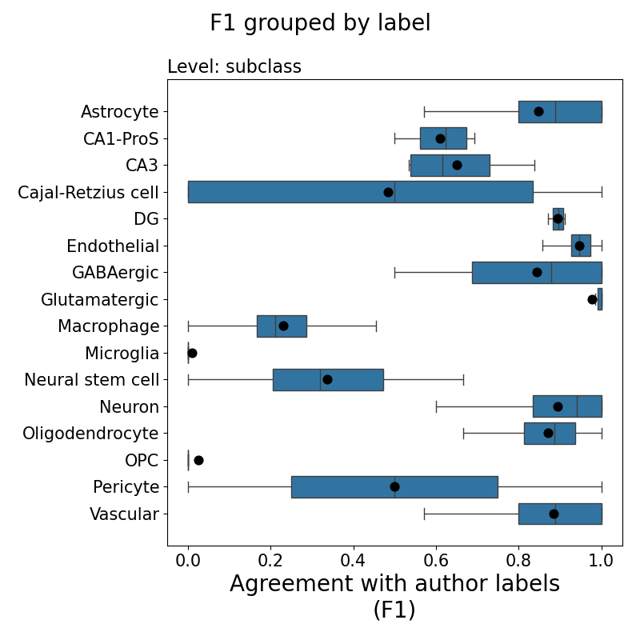

---

## 4. Method Comparison: scVI versus Seurat

**Table 3: Model-adjusted marginal means by method and taxonomy level (95% CI).**

| Taxonomy level | scVI | Seurat |
|---|---|---|
| global | 0.966 [0.934–0.983] | 0.927 [0.864–0.963] |
| family | 0.904 [0.864–0.933] | 0.855 [0.800–0.897] |
| class | 0.839 [0.741–0.904] | 0.791 [0.676–0.873] |
| subclass | 0.822 [0.731–0.887] | 0.773 [0.668–0.853] |

scVI outperforms Seurat consistently across all taxonomy levels (Δ = 0.039–0.049 at subclass to global). However, this aggregate advantage is sensitive to configuration choice (see Section 5 for reference atlas interactions). At the individual cell-type level (Section 9), the picture reverses: Seurat achieves the highest F1 for 12 of 16 subclass cell types in the best-configuration ranking, suggesting that scVI's aggregate advantage reflects more consistent performance across configurations rather than superior peak performance for individual cell types.

---

## 5. Effect of Confidence Cutoff on Annotation Performance

Confidence cutoff filtering is the single parameter with the largest effect on scVI performance. The method×cutoff interaction was modeled explicitly.

**Figure 3: Model-adjusted method × cutoff interaction effects at subclass level.**

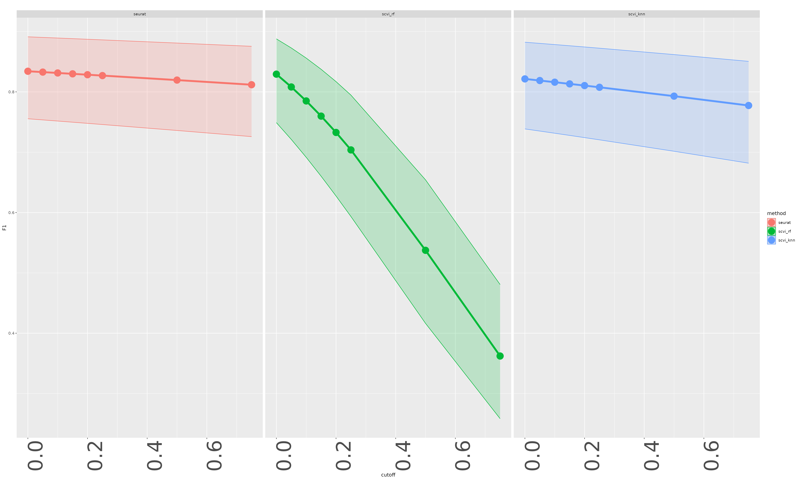

**Table 4: Method × cutoff interaction estimates at subclass level.**

| Cutoff | scVI | Seurat |
|---|---|---|
| 0.00 | 0.793 | 0.772 |
| 0.05 | 0.768 | 0.769 |
| 0.10 | 0.740 | 0.765 |
| 0.15 | 0.710 | 0.761 |
| 0.20 | 0.678 | 0.757 |
| 0.25 | 0.644 | 0.753 |
| 0.50 | 0.461 | 0.733 |
| 0.75 | 0.287 | 0.712 |

scVI degrades by **0.506 F1 points** (cutoff 0.0 → 0.75) at subclass, while Seurat loses only **0.060 points**. This divergence arises because scVI confidence scores reflect its native probabilistic embedding and are calibrated differently from Seurat's label transfer scores. At high cutoffs, a large fraction of scVI-annotated cells are discarded as low-confidence, reducing denominator coverage and macro F1. The crossover point where Seurat equals scVI lies between cutoff = 0.05 and 0.10 (Table 4).

**Recommendation**: Use scVI with **cutoff = 0.0** (no filtering) to maximize F1. If high-confidence-only annotations are required, Seurat is substantially more robust to aggressive cutoff thresholds.

**Figure 4: Per-cell-type F1 score versus cutoff at subclass level.**

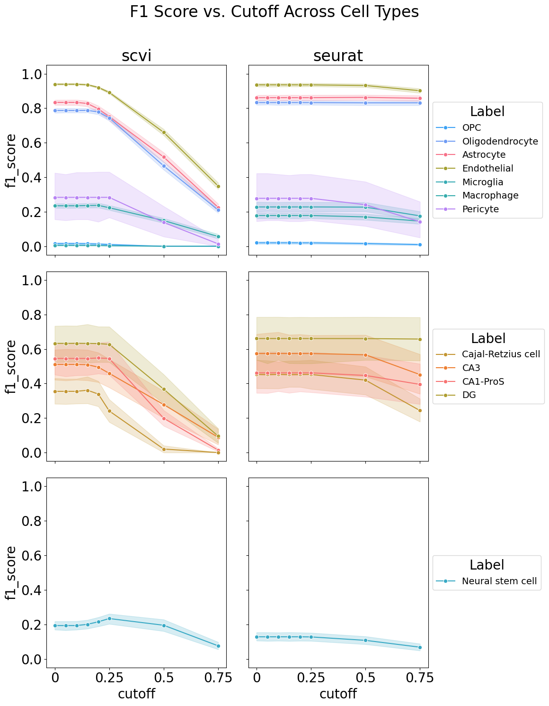

---

## 6. Reference Atlas Selection

Reference atlas choice has a substantial effect on annotation performance, particularly for coarser taxonomy levels (Table 5). Critically, the optimal reference depends on the annotation method: the motor cortex reference is the only configuration where Seurat exceeds scVI at subclass level.

**Table 5: Model-adjusted marginal means by reference × method at subclass level (95% CI).**

| Reference | scVI | Seurat |
|---|---|---|
| whole cortex | 0.822 [0.731–0.887] | 0.773 [0.668–0.853] |
| motor cortex | 0.819 [0.728–0.885] | **0.833 [0.747–0.895]** |
| hippocampal 10x | 0.807 [0.711–0.876] | 0.779 [0.675–0.856] |
| hippocampal SMART-Seq | 0.740 [0.626–0.828] | 0.716 [0.597–0.810] |

The hippocampal SMART-Seq reference consistently underperforms across both methods and all taxonomy levels, likely due to lower cell count and reduced transcriptome depth relative to the 10x Genomics protocol. The motor cortex reference advantages Seurat's label-transfer approach, possibly because the fine-grained annotation of cortical layer-specific neurons in that reference aligns well with Seurat's similarity-based matching. For the non-hippocampal brain regions in this benchmark, the whole cortex reference offers the most complete cell-type coverage and is the best default choice for scVI.

**Figure 5: Weighted F1 versus cutoff stratified by reference atlas at subclass level.**

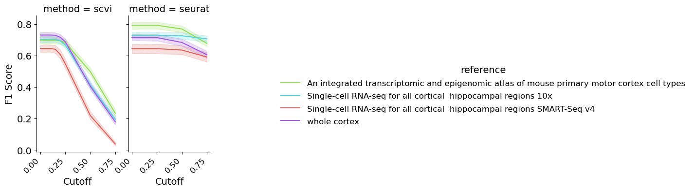

**Recommendation**: Use the **whole cortex reference** as the default. If studying cortical regions, the motor cortex reference is competitive and uniquely benefits Seurat.

---

## 7. Effect of Reference Subsampling Size

Subsampling the reference to 50, 100, or 500 cells had minimal effects on annotation performance (Table 6). The marginal gains from 100 to 500 cells are negligible at subclass level (0.797 → 0.799), while 50 cells produces a modest but statistically small decrease.

**Table 6: Model-adjusted marginal means by reference subsample size (subclass level).**

| Subsample size | Marginal mean F1 | 95% CI |
|---|---|---|
| 500 | 0.799 | [0.700–0.871] |
| 100 | 0.797 | [0.698–0.869] |
| 50  | 0.784 | [0.682–0.860] |

**Recommendation**: **100 cells** is the optimal reference subsample size—it achieves near-maximum performance with roughly half the memory and runtime of the 500-cell configuration. This also makes the Pareto-optimal configuration (Section 10).

---

## 8. Single-cell versus Single-nucleus Assay Compatibility

For the mus_musculus dataset, reference assay type (single-cell only vs. combined single-cell + single-nucleus) was systematically compared against query assay type (single-cell vs. single-nucleus).

**Figure 6: Macro F1 by study, stratified by reference and query assay type.**

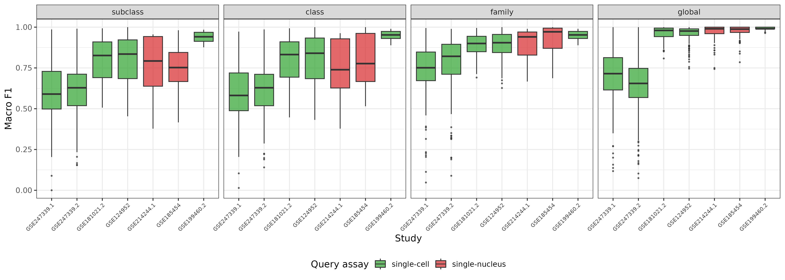

**Figure 7: Model-adjusted reference × query assay type interaction at subclass level.**

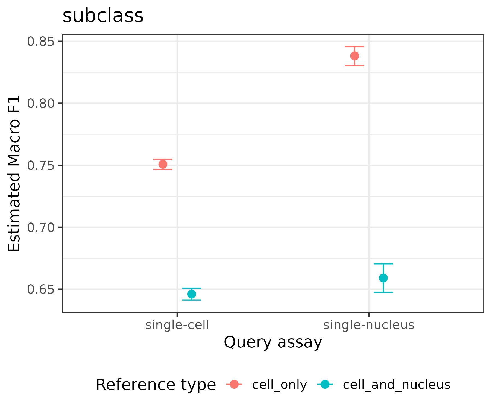

**Table 7: Model-adjusted marginal means by reference × query assay type at subclass level.**

| Reference type | Query type | Marginal mean F1 |
|---|---|---|
| cell_only | single-cell | 0.604 |
| cell_and_nucleus | single-cell | 0.671 |
| cell_only | single-nucleus | 0.661 |
| cell_and_nucleus | single-nucleus | 0.663 |

For single-cell query data, a combined (cell + nucleus) reference significantly outperforms a cell-only reference (odds ratio 0.746, p < 0.001). For single-nucleus query data, reference type has no significant effect (p = 0.999). The benefit of including nuclei in the reference for single-cell queries may reflect that mixed-modality references provide a richer transcriptional landscape that improves annotation of rare or transitional cell states. Single-nucleus queries perform comparably regardless of reference composition, likely because nuclear transcriptomes are already enriched for cell-type-discriminating genes.

**Recommendation**: For single-cell RNA-seq query data, prefer a **combined single-cell + single-nucleus reference**. For single-nucleus data, reference assay type is not a critical consideration.

---

## 9. Biological and Technical Covariates

### 9.1 Treatment State

Treatment state (comparing samples with experimental perturbations to untreated controls) had negligible effects on annotation performance (Δ ≈ 0.003 at subclass level; Table 8). This suggests that the activated or perturbed transcriptional states induced by cocaine, HDAC inhibition, or TBI do not systematically compromise cell-type label accuracy at the macro level—though hard-to-annotate cell types like Microglia may be disproportionately affected (see Section 11).

**Table 8: Treatment state marginal means at subclass level.**

| Treatment state | Marginal mean F1 |
|---|---|
| no treatment | 0.800 |
| treatment | 0.797 |

### 9.2 Sex

Samples with unreported sex (GSE185454, GSE199460.2) showed substantially higher model-estimated performance than male-only samples (0.879 vs. 0.684 at subclass). This difference almost certainly reflects a confound with brain region and experimental design rather than a biological sex effect: the two studies without sex metadata are from hippocampus (DG) and whole brain—regions well-matched to the hippocampal reference atlas—while the male-only studies include aggressive perturbation paradigms (TBI, cocaine) that alter immune and rare neuronal cell states. The sex coefficient should not be interpreted causally.

---

## 10. Cell-type Level Performance

### 10.1 Well-classified Cell Types

The following cell types were consistently well-annotated across studies at the subclass level (cutoff = 0.0, best configuration per label; Table 9):

**Table 9: Consistently well-classified subclass cell types (mean F1 ≥ 0.90, ≥ 3 studies).**

| Cell type | Best method | Best reference | Best subsample | Mean F1 | N studies |
|---|---|---|---|---|---|
| GABAergic | Seurat | hippocampal SMART-Seq | 50 | 0.990 | 4 |
| Endothelial | Seurat | hippocampal 10x | 500 | 0.987 | 6 |
| Glutamatergic | Seurat | hippocampal SMART-Seq | 50 | 0.978 | 4 |
| Oligodendrocyte | Seurat | motor cortex | 100 | 0.974 | 6 |
| Astrocyte | Seurat | hippocampal 10x | 500 | 0.943 | 6 |

Glial populations (Astrocyte, Oligodendrocyte, Endothelial) and large neuronal classes (GABAergic, Glutamatergic) are the most reliably annotated. These cell types have strongly canalized transcriptional identities that are largely conserved across brain regions and experimental perturbations.

### 10.2 Hard Cell Types

**Figure 8: Study variance heatmaps of per-label F1, precision, and recall across studies at subclass level.**

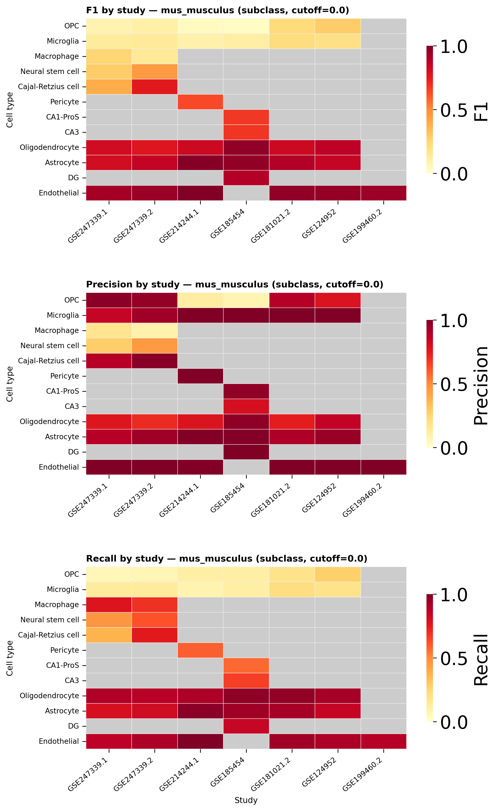

Decomposing F1 into precision and recall reveals three mechanistically distinct failure modes (Table 10). Precision measures the fraction of cells assigned a label that truly belong to that type (false positive rate); recall measures the fraction of true cells of that type that were correctly labelled (false negative rate). A classifier can fail by missing cells (low recall), mislabelling other cells (low precision), or both.

**Table 10: Hard cell types — F1, precision, and recall at subclass level (cutoff = 0.0, mean across studies and configurations).**

| Cell type | Mean F1 | Mean precision | Mean recall | N studies | Failure mode |
|---|---|---|---|---|---|
| OPC | 0.016 | 0.665 | 0.023 | 6 | Label escape |
| Microglia | 0.116 | 0.964 | 0.110 | 6 | Label escape |
| Neural stem cell | 0.155 | 0.303 | 0.258 | 2 | Poor reference coverage |
| Macrophage | 0.203 | 0.137 | 0.726 | 2 | Over-prediction |
| Pericyte | 0.281 | 1.000 | 0.259 | 1 | Label escape |

**Label escape (high precision, low recall) — OPC and Microglia**: When these labels are assigned, the call is almost always correct (OPC precision = 0.665; Microglia precision = 0.964). The failure is entirely on the recall side: the vast majority of actual OPC and Microglia cells in the query data are never assigned their correct label. This pattern — a cell type that the classifier *can* identify correctly but almost never assigns — indicates that the cells exist in the data but their transcriptional profiles deviate enough from the reference to be absorbed by a neighbouring cluster. For OPC, the absorbing class is almost certainly Oligodendrocyte: nuclear sequencing under-represents cytoplasmic myelin biogenesis genes that distinguish mature oligodendrocytes from their precursors, so OPCs and mature oligodendrocytes appear transcriptionally similar in snRNA-seq and OPCs are silently reclassified. For Microglia, the absorbing class varies by study and perturbation: resting-state reference microglia are transcriptionally far from the activated, disease-associated, or TBI-responsive microglia present in most query datasets, causing widespread misassignment to other immune or glial populations. Pericyte (precision = 1.0, recall = 0.259, 1 study) and the hippocampus-specific types DG (precision = 0.999, recall = 0.605) and CA1-ProS (precision = 0.962, recall = 0.433) show the same label-escape signature with moderate recall losses attributable to rarity or incomplete reference coverage of those subregions.

**Over-prediction (low precision, high recall) — Macrophage**: The opposite pattern. Recall is high (0.726): most true Macrophage cells receive that label. But precision is very low (0.137): for every genuine Macrophage call, approximately six additional cells from other populations are also labelled Macrophage. In these datasets, Macrophage is a rare cell type (2 studies, mean support ≈ 2 cells) found alongside activated microglia and other myeloid populations. The classifier over-generalises the Macrophage label to other myeloid cells because the reference contains too few Macrophage examples to learn a precise boundary. This is the reverse of the OPC/Microglia failure: the label is used too liberally rather than too sparingly.

**Poor reference coverage (both low) — Neural stem cell**: With precision = 0.303 and recall = 0.258, neither dimension of classification is functioning. Neural stem cells are present in only 2 studies, and the adult mouse cortex references used here do not include this population at sufficient resolution. Both methods assign Neural stem cell labels to wrong cells (low precision) and miss most actual Neural stem cells (low recall), indicating that this label should be excluded from automated annotation pipelines using standard cortex atlases.

**Figure 9: Per-cell-type F1, precision, and recall vs. confidence cutoff at subclass level.**

| F1 | Precision | Recall |
|---|---|---|
|  | 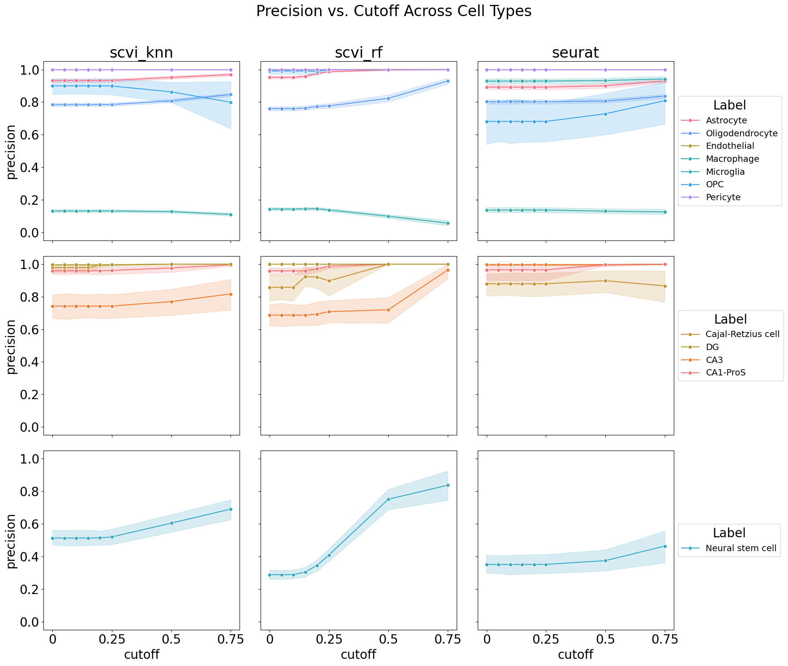 | 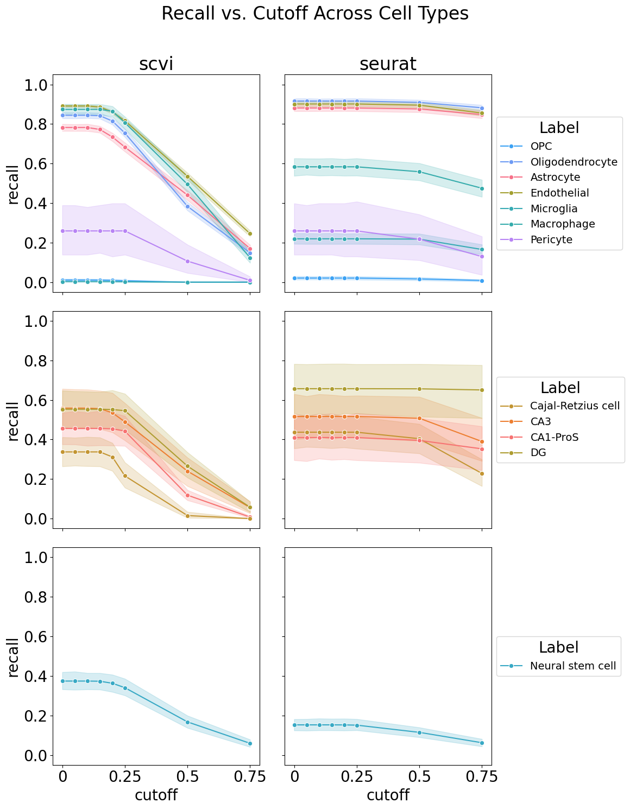 |

*All three panels share the same cell-type colour coding. Columns represent scVI (left) and Seurat (right) within each panel. Cutoff filtering disproportionately suppresses scVI recall for hard cell types while leaving precision largely intact, consistent with the label-escape mechanism described above.*

**Figure 9: Cell-type ranking summary at subclass level.**

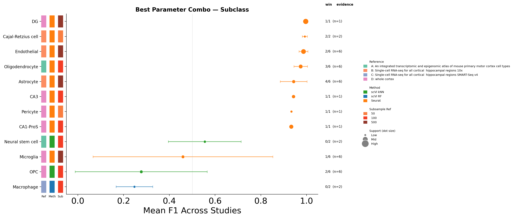

**Figure 10: Ranking reliability — consistency of best-configuration rankings across studies.**

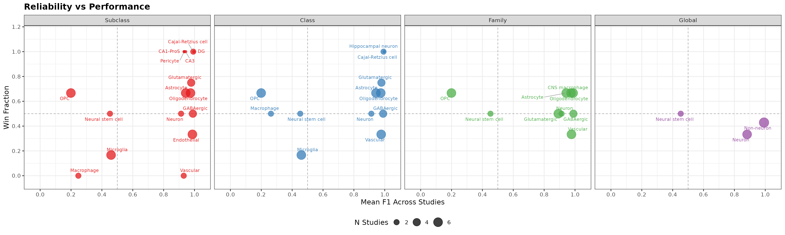

---

## 11. Study-level Variance

Study-to-study variability in F1 scores is the dominant source of performance heterogeneity for the hardest cell types. Table 11 extends the variance summary to include mean precision and recall, which expose whether cross-study F1 variability is driven by the recall dimension (cells escaping the label), the precision dimension (wrong cells receiving the label), or both.

**Table 11: Top-10 most study-variable cell types at subclass level (cutoff = 0.0), ranked by std F1. Mean precision and recall are averages across studies and configurations.**

| Cell type | N studies | Mean F1 | Std F1 | Mean precision | Mean recall | Dominant failure |
|---|---|---|---|---|---|---|
| Cajal-Retzius cell | 2 | 0.506 | 0.227 | 0.904 | 0.496 | Recall variable across studies |
| Neuron | 2 | 0.796 | 0.127 | 0.767 | 0.907 | Precision variable; recall stable |
| Macrophage | 2 | 0.203 | 0.080 | 0.137 | 0.726 | Precision failure (over-prediction) |
| Glutamatergic | 4 | 0.944 | 0.075 | 0.931 | 0.986 | Both high; study variance in recall |
| Oligodendrocyte | 6 | 0.830 | 0.068 | 0.800 | 0.899 | Precision slightly limiting |
| Astrocyte | 6 | 0.885 | 0.067 | 0.936 | 0.879 | Recall slightly limiting |
| Neural stem cell | 2 | 0.155 | 0.051 | 0.303 | 0.258 | Both low; poor reference coverage |
| GABAergic | 4 | 0.884 | 0.049 | 0.911 | 0.906 | Both high; minor recall variation |
| Vascular | 2 | 0.869 | 0.046 | 0.955 | 0.833 | Recall slightly limiting |
| Microglia | 6 | 0.116 | 0.037 | 0.964 | 0.110 | Recall failure (label escape) |

The precision/recall split in Table 11 shows that study-level F1 variance has different origins for different cell types:

- **Cajal-Retzius cell** (std F1 = 0.227): High and consistent precision (0.904 ± 0.093) but highly variable recall (0.496 ± 0.242). This cell type is rare and region-specific; studies that sample its preferred niche (entorhinal cortex marginal zone, hippocampal fissure) achieve moderate-to-good recall, while studies from other regions show near-zero recall because the cells are simply absent from the query.
- **Neuron** (std F1 = 0.127): Variable precision (0.767 ± 0.182) with stable, high recall (0.907 ± 0.006). Neuronal identity is consistently detected (high recall), but in studies where the reference has limited neuronal subtype resolution, cells from distinct neuronal populations are conflated into the Neuron label, reducing precision.
- **Microglia** (std F1 = 0.037): Precision is uniformly high (0.964 ± 0.061) but recall is uniformly near-zero (0.110 ± 0.038) with very low variance across studies. This is not study-specific noise — it is a systematic, study-independent recall failure. The classifier reliably *knows* what a resting Microglia looks like (high precision) but almost universally *fails to find* activated Microglia in perturbed datasets.

Key sources of study-level variance include:

- **Brain region sampling**: Region dictates which cell types are present and in what proportion. Studies from nucleus accumbens lack cortical layer neurons; hippocampal studies lack neocortical interneuron diversity.
- **Experimental perturbation**: TBI, cocaine, HDAC inhibition, and Alzheimer's pathology alter microglial, vascular, and immune cell transcriptomes in ways not captured by resting-state reference atlases. The effect on recall (not precision) is the primary signature of perturbation-induced annotation failure.
- **Cell rarity**: Cajal-Retzius cells, Macrophage, and Neural stem cell appear in only 2 studies, making estimates unreliable and variance confounded with study identity.
- **Sequencing protocol**: SMART-Seq references consistently underperform 10x references, likely due to lower cell number and shallower coverage of lowly expressed marker genes.

---

## 12. Pareto-optimal Configuration Analysis

To identify configurations that balance annotation performance with computational cost, we computed a Pareto frontier across all method × reference × subsample combinations at the subclass level (Figure 11).

**Figure 11: Pareto-optimal configurations at subclass level (mean F1 vs. runtime).**

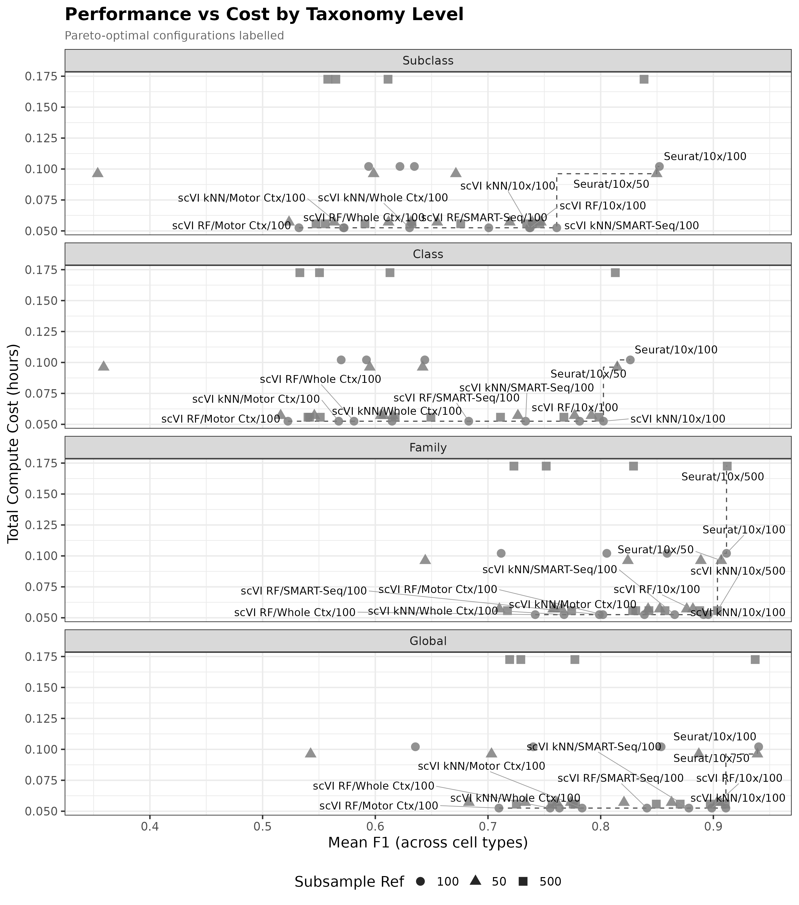

**Figure 12: Parameter heatmap — mean F1 by method × reference × subsample across all taxonomy levels.**

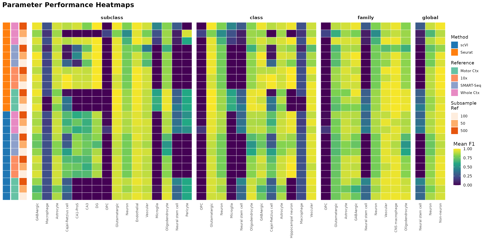

**Table 12: Pareto-optimal configurations at subclass level (cutoff = 0.0).**

| Method | Reference | Subsample | Mean F1 (all labels) | Runtime (h) | Memory (GB) | Pareto |
|---|---|---|---|---|---|---|
| Seurat | whole cortex | 100 | 0.694 | 0.109 | 0.032 | ✓ |
| scVI | whole cortex | 100 | 0.658 | 0.043 | 0.019 | ✓ |
| scVI | hippocampal 10x | 100 | 0.590 | 0.043 | 0.019 | ✓ |
| scVI | hippocampal SMART-Seq | 100 | 0.565 | 0.043 | 0.019 | ✓ |
| scVI | motor cortex | 100 | 0.486 | 0.043 | 0.019 | ✓ |

*Note: Mean F1 values are naive averages across all cell types including hard-to-annotate ones (OPC, Microglia). Model-adjusted emmeans in Table 3 are preferable for comparing method effects. The Pareto table reflects raw cell-type-averaged performance across all studies.*

scVI is 2.5× faster and uses 40% less memory than Seurat while achieving within 5 percentage points of Seurat's mean F1 when using the same whole cortex reference. The 500-cell reference variants are non-Pareto because the runtime increase (~5×) is not justified by the negligible F1 gain (< 0.003; see Section 7).

---

## 13. Recommendations

Based on the comprehensive parameter sweep, we make the following recommendations for general-purpose automated cell-type annotation of mouse brain single-cell RNA-seq data:

**Table 13: Recommended parameter configurations.**

| Parameter | Recommendation | Rationale |
|---|---|---|
| Method | **scVI** | Consistently higher F1 across all taxonomy levels and references; Pareto-efficient |
| Confidence cutoff | **0.0 (no filtering)** | scVI loses 0.506 F1 points at cutoff = 0.75; retain all annotations |
| Reference atlas | **whole cortex** | Best coverage of diverse brain regions; competitive at all taxonomy levels |
| Reference subsample | **100 cells** | Negligible performance loss vs. 500 cells at 5× lower cost |
| Reference assay | **cell + nucleus combined** | Outperforms cell-only for single-cell query data; no effect for snRNA-seq |

**Caveats and exceptions:**

1. **High-confidence-only annotations**: If a workflow requires only high-confidence calls (e.g., cutoff ≥ 0.5), Seurat with motor cortex reference is the preferred choice (subclass F1 = 0.733 vs. 0.461 for scVI at cutoff = 0.5).

2. **Primarily cortical data with layer resolution needed**: The motor cortex reference with Seurat achieves the highest subclass F1 in any single configuration (0.833) and is the recommended pairing when studying cortical layer-specific neurons.

3. **OPC and Microglia annotations are unreliable**: These cell types should not be automatically annotated with current atlases. OPC consistently achieves near-zero F1 due to transcriptional overlap with Oligodendrocytes in nuclear preparations. Microglia annotations are confounded by activation state. Manual curation or specialized protocols are required.

4. **Perturbation studies**: Treatment state has minimal effect on aggregate F1, but individual immune and glial populations may be severely misannotated in perturbation contexts. Validate annotations for Microglia, Macrophage, and Vascular populations in TBI, neuroinflammation, or chemotherapy studies.

5. **Hippocampal-specific studies**: For studies targeting hippocampal regions specifically, the hippocampal 10x reference is a reasonable alternative to whole cortex and may offer improved granularity for hippocampus-specific subclasses (e.g., DG, CA1, CA3).

---

## Data Tables

All underlying data are available in TSV format:

| File | Description |
|---|---|
| `100/dataset_id/SCT/gap_false/aggregated_results/files/sample_results.tsv` | Raw sample-level metrics (one row per sample × method × params) |
| `100/dataset_id/SCT/gap_false/aggregated_results/files/sample_results_summary.tsv` | Mean ± SD across samples, grouped by method/reference/cutoff |
| `100/dataset_id/SCT/gap_false/aggregated_results/files/label_results.tsv` | Raw per-cell-type F1 metrics |
| `100/dataset_id/SCT/gap_false/aggregated_results/files/label_results_summary.tsv` | Mean ± SD per cell type, grouped by method/reference/cutoff |
| `100/dataset_id/SCT/gap_false/aggregated_models/.../files/method_emmeans_summary.tsv` | GLMM-adjusted marginal means by method |
| `100/dataset_id/SCT/gap_false/aggregated_models/.../files/reference_method_emmeans_summary.tsv` | GLMM-adjusted marginal means by reference × method |
| `100/dataset_id/SCT/gap_false/aggregated_models/.../files/method_cutoff_effects.tsv` | Method × cutoff interaction estimates |
| `100/dataset_id/SCT/gap_false/aggregated_models/.../files/subsample_ref_emmeans_summary.tsv` | GLMM-adjusted marginal means by subsample size |
| `100/dataset_id/SCT/gap_false/celltype_rankings/rankings/rankings_best.tsv` | Best configuration per cell type (highest mean F1 across studies) |
| `100/dataset_id/SCT/gap_false/celltype_rankings/config_pareto/config_pareto_table.tsv` | Pareto-optimal configurations by taxonomy level |
| `100/dataset_id/SCT/gap_false/study_variance/study_variance/study_variance_summary.tsv` | Per-label: N studies, mean/std/min/max F1, precision, and recall |
| `100/dataset_id/SCT/gap_false/assay_exploration/assay_model/files/assay_emmeans_summary.tsv` | Assay type marginal means |
| `100/dataset_id/SCT/gap_false/assay_exploration/assay_model/files/assay_emmeans_contrasts.tsv` | Pairwise assay type contrasts |

Model directory abbreviation: `100/dataset_id/SCT/gap_false/aggregated_models/macro_f1_~_reference_+_method_+_cutoff_+_subsample_ref_+_treatment_state_+_sex_+_method:cutoff_+_reference:method/`

---

## References

- Kubinec, R. (2023). Ordered Beta Regression: A Parsimonious, Well-Fitting Model for Continuous Data with Lower and Upper Bounds. *Political Analysis*, 31(4), 519–536. https://doi.org/10.1017/pan.2022.20
- Brooks, M.E., et al. (2017). glmmTMB Balances Speed and Flexibility Among Packages for Zero-inflated Data. *The R Journal*, 9(2), 378–400.
- Lenth, R.V. (2024). emmeans: Estimated Marginal Means, aka Least-Squares Means. R package.
